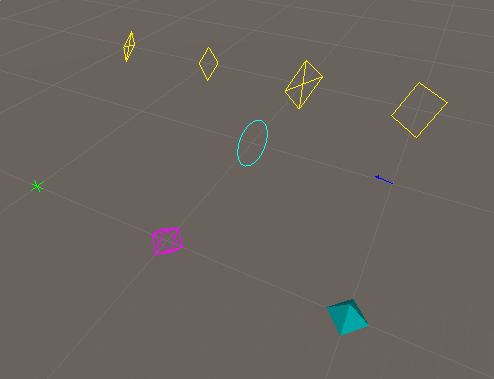

# GizmosPlus
A toolkit for easier Gizmo usage in Unity.
Contains various commonly used useful shapes and also functionality for
drawing Gizmos outside of normal OnDrawGizmos flow.




## Installation

Simply open your `manifest.json` file located in the `Packages` folder of your
unity project and add the follwing line to thel ist of `dependencies`:
```
"com.zchfvy.gizmosplus": "https://github.com/zchfvy/GizmosPlus.git"
```

## Usage

At the top of your file use the Plus namespace
```
using Zchfvy.Plus
```

Then simply call methods out of the `GizmosPlus` class
```
GizmosPlus.Cross(transform.position, 1.0f)
```

For creating Gizmos outside normal flow use the `GizmosPlusAsync` class
```
GizmosPlusAsync.DrawAsync(() => {
    // Draw Gizmos in here
});
```

For a complete listing of available methods and their parameters please consult
the [Documentation](https://zchfvy.github.io/GizmosPlus/Documentation/html/annotated.html)
